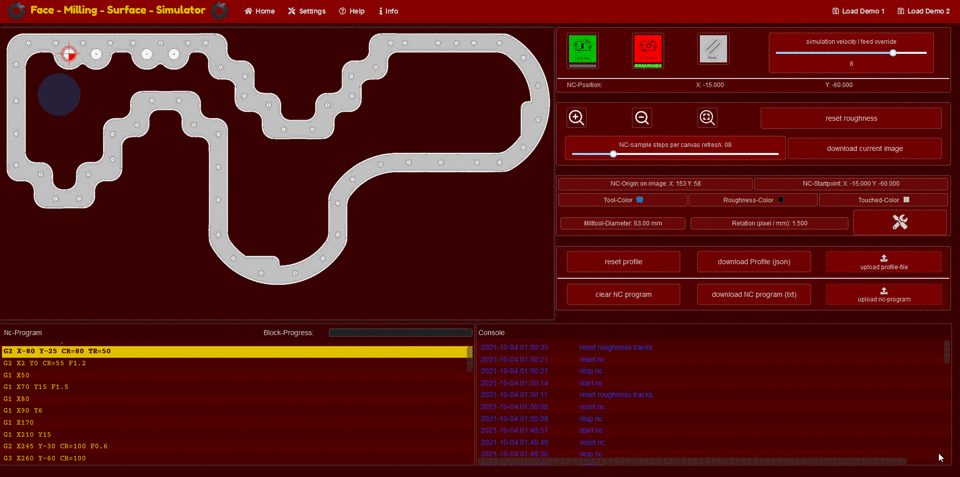

# face-milling-surface-simulator



## ***!!! project describtion coming soon !!!***
# 
## [TODO](TODO.md)
# 
## Project setup

### Prerequisite

- [Node.JS v12](https://nodejs.org/download/release/v12.8.0/)

### Install the repository
```
git clone https://github.com/Oigty81/face-milling-surface-simulator.git
cd face-milling-surface-simulator
npm install
```

### Compiles and hot-reloads for development
```
npm run serve
```

### Compiles and minifies for production
```
npm run build
```

### Run your unit tests
```
npm run test:unit
```

# 
